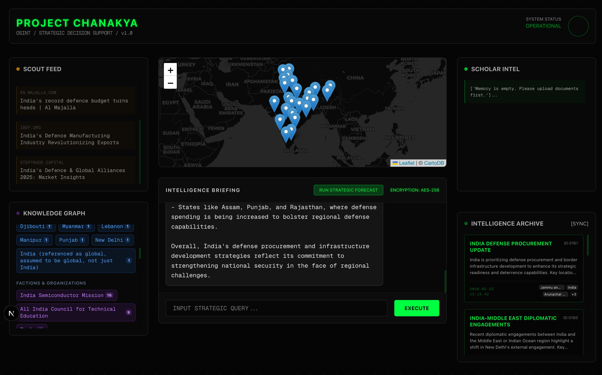
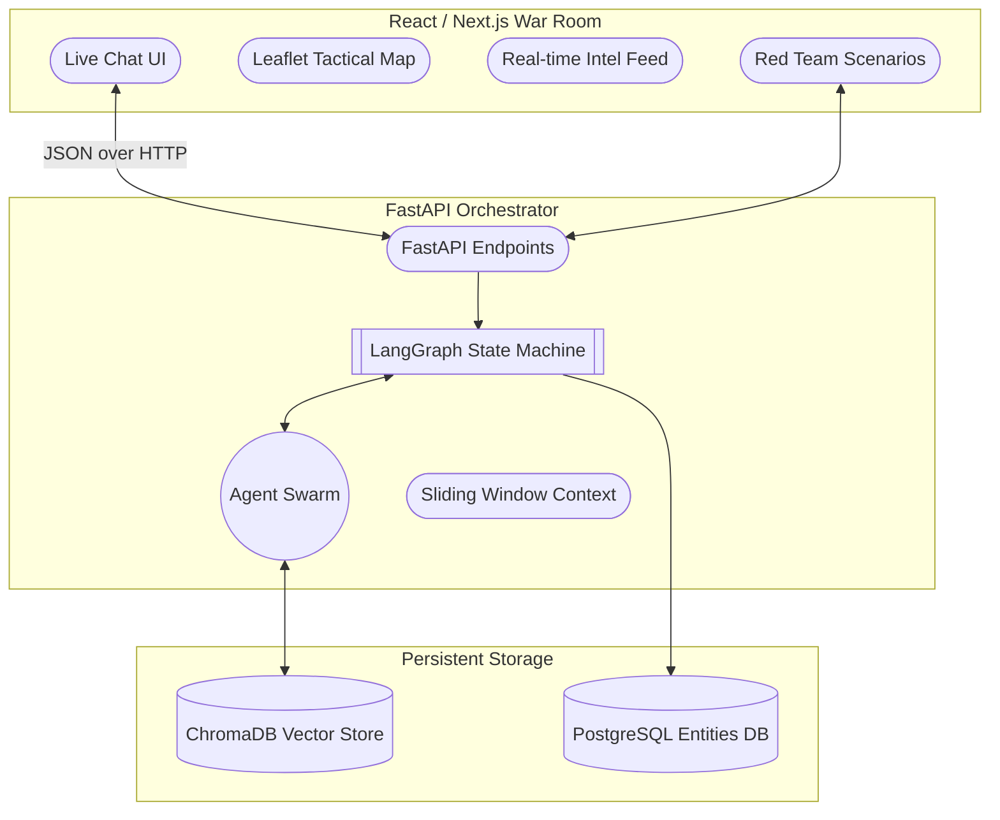

<div align="center">
  
  <h1 align="center">PROJECT CHANAKYA</h1>
  <p align="center">
    <strong>An Autonomous, Multi-Agent OSINT Defense & Strategic Decision Support System</strong>
  </p>
  <p align="center">
    <a href="#features">Features</a> •
    <a href="#architecture">Architecture</a> •
    <a href="#deployment">Deployment</a> •
    <a href="#tech-stack">Tech Stack</a>
  </p>
</div>

---

## 🦅 Overview

<div align="center">
  
</div>
<br/>

**Project Chanakya** is a state-of-the-art Open Source Intelligence (OSINT) and Strategic Decision Support platform. Built on the principles of Palantir architectures, it utilizes a swarm of specialized AI agents working in tandem to ingest classified documents, scrape real-time web intelligence, extract geocoordinates, track persistent entities, and synthesize deterministic, strategic forecasts. 

It is designed to handle high-level geopolitical analysis, threat assessments, and live global event monitoring—all exposed through a sleek, military-style React War Room dashboard.

## 🛡️ Core Agent Swarm (LangGraph)

Chanakya’s brain is a **LangGraph** ReAct state machine featuring 6 specialized AI operatives:

1. **🧠 The Scholar (RAG)**: Ingests thousands of pages of PDF doctrine, querying a local ChromaDB vector space to ground the system in historical and tactical reality.
2. **👁️ The Scout (Web Search)**: An autonomous webscraper utilizing DuckDuckGo APIs to fetch up-to-the-minute news, social sentiment, and live intelligence.
3. **🗺️ The Cartographer**: Scans incoming intelligence specifically for geographic data, extracting precise latitude/longitude coordinates to plot troop movements or incidents on the live tactical map.
4. **🕵️ The Entity Extractor**: Identifies and logs persistent People, Organizations, and Countries across all briefings, saving mention frequencies to a PostgreSQL database for long-term network analysis.
5. **♟️ The Strategist & Red Team**: Takes synthesized intelligence and runs predictive modeling, explicitly generating "Optimistic", "Base", and "Pessimistic / Black Swan" adversarial scenarios.
6. **🗣️ The Synthesizer**: The master orchestrator that reads the output of the entire swarm, strips out hallucinations, and writes the final, actionable Chief Executive Briefing.

## 🏛️ Architecture

The system utilizes a modern, containerized Full-Stack architecture separating the heavy Python AI processes from the high-performance Next.js visualization layer.



## 🚀 Deployment (Docker)

Project Chanakya is designed to be effortlessly deployed on any cloud provider or bare-metal server using Docker Compose.

### Prerequisites
- Docker & Docker Compose
- A free [Groq API Key](https://console.groq.com) for blazing-fast Llama-3 inference.

### Quick Start

1. **Clone the repository:**
   ```bash
   git clone https://github.com/yourusername/project-chanakya.git
   cd project-chanakya
   ```

2. **Configure Environment:**
   ```bash
   cp .env.example .env
   ```
   *Open `.env` and insert your `GROQ_API_KEY` and set a strong `POSTGRES_PASSWORD`.*

3. **Launch the Swarm:**
   ```bash
   docker compose up --build -d
   ```

4. **Access the War Room:**
   Navigate to `http://localhost:3000` in your web browser. 
   *(The FastAPI Swagger UI is available at `http://localhost:8000/docs`)*

## 💻 Tech Stack

- **Frontend**: Next.js 14, React, Tailwind CSS, React-Leaflet (OSM).
- **Backend**: Python 3.11, FastAPI, Uvicorn, APScheduler (Cron).
- **AI / LLM Orchestration**: LangGraph, LangChain, Groq (Llama-3), SentenceTransformers.
- **Databases**: PostgreSQL (Relational Memory), ChromaDB (Vector Store), SQLAlchemy (ORM).
- **Deployment**: Docker, Docker Compose Multi-Stage Builds.

---
*Developed for strategic situational awareness and adversarial network defense. Use responsibly.*
